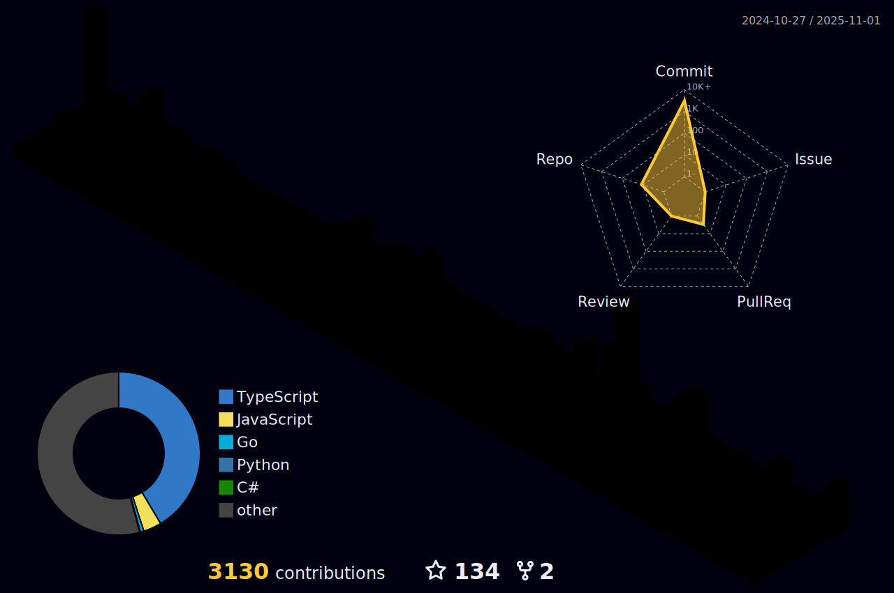

<a align="left" href="https://instagram.com/hz.barisg" target="blank"></a>
 
<h1 align="center">
  
  𝐇𝐞𝐥𝐥𝐨, &lt;𝚌𝚘𝚍𝚎𝚛𝚜/&gt;!
  
</h1>
<p align="center">
  
  
  
</p>


- 🔭 𝙸’𝚖 𝚌𝚞𝚛𝚛𝚎𝚗𝚝𝚕𝚢 𝚠𝚘𝚛𝚔𝚒𝚗𝚐 𝚘𝚗 **Windows and Web Development.**
- 👯 𝙸’𝚖 𝚕𝚘𝚘𝚔𝚒𝚗𝚐 𝚝𝚘 𝚌𝚘𝚕𝚕𝚊𝚋𝚘𝚛𝚊𝚝𝚎 𝚘𝚗 **Web, Android, Windows and Linux.**
- 💬 𝙰𝚜𝚔 𝙼𝚎 𝙰𝚋𝚘𝚞𝚝 𝙰𝚗𝚢𝚝𝚑𝚒𝚗𝚐 [here](https://github.com/MutanPlex/MutanPlex/issues/1) ! 𝙸 𝚊𝚖 𝚑𝚊𝚙𝚙𝚢 𝚝𝚘 𝚑𝚎𝚕𝚙.
- ⚡ Fun fact **Everything is just beginning...**


<br>

# Connect  

	
[](https://codepen.io/mutanplex)
[](https://dev.to/mutanplex)
[](https://twitter.com/mutanplex)
[](https://linkedin.com/in/mutanplex)
[](https://stackoverflow.com/users/16177373)
[](https://instagram.com/hz.barisg)
[](https://dribbble.com/mutanplex)
[](https://www.behance.net/mutanplex)
[](https://medium.com/@mutanplex)
[](https://www.youtube.com/c/mutanplex)
[](https://discord.gg/Qj72GXF)

<br>


<!--- ------------------------------------------------------------------------------------------------------------------------------------------------------ -->
<!--- -- Skills Section ------------------------------------------------------------------------------------------------------------------------------------ -->
<!--- ------------------------------------------------------------------------------------------------------------------------------------------------------ -->

# Skills  

| Category        | Skills        |
|-----------------|---------------|
| Frameworks|       |
| Languages       |       |
| Styling & Frameworks |      |
| Database |     |
| Services & Tools|  <a href="https://github.com/MutanPlex"></a>   |
| Competitive Coding | <a href="https://leetcode.com/MutanPlex/"></a> <a href="https://www.codechef.com/users/MutanPlex"></a> |
| IDE & Environment |       |
| Hosting         |      |
| APIs |     |
| Design Tools    |     |


<br>

# Sponsor me  

> I've made significant contributions to the open source ecosystem. Sponsoring me gives you access to exclusive benefits, such as a private Discord channel and more. Visit the [sponsors page](https://github.com/sponsors/MutanPlex) for further details.

<a href="https://github.com/sponsors/MutanPlex"></a>
<a href="https://www.buymeacoffee.com/mutanplex"></a>
<br>
<br>

# My Github Stats 



<h4 align="center">
  
```diff
+@ @ @ @ @ @ @ @ @ @ @ @ @ @ @ @ @ @ @ @ @ @ @ @ @ @ @ @+
@@       o o                                           @@
@@       | |                                           @@
@@      _L_L_                                          @@
@@   ❮\/__-__\/❯ Programming isn't about what you know @@
@@   ❮(|~o.o~|)❯  It's about what you can figure out   @@
@@   ❮/ \`-'/ \❯                                       @@
@@     _/`U'\_                                         @@
@@    ( .   . )     .----------------------------.     @@
@@   / /     \ \    | while( ! (succeed=try() ) ) |     @@
@@   \ |  ,  | /    '----------------------------'     @@
@@    \|=====|/                                        @@
@@     |_.^._|                                         @@
@@     | |"| |                                         @@
@@     ( ) ( )   Testing leads to failure              @@
@@     |_| |_|   and failure leads to understanding    @@
@@ _.-' _j L_ '-._                                     @@
@@(___.'     '.___)                                    @@
+@ @ @ @ @ @ @ @ @ @ @ @ @ @ @ @ @ @ @ @ @ @ @ @ @ @ @ @+
```

</h4>  


# My Wakatime Stats 
<br>

<!--START_SECTION:waka-->


**🐱 My GitHub Data** 

> 📦 329.1 kB Used in GitHub's Storage 
 > 
> 🚫 Not Opted to Hire
 > 
> 📜 36 Public Repositories 
 > 
> 🔑 28 Private Repositories 
 > 
**I'm a Night 🦉** 

```text
🌞 Morning                614 commits         ███████████░░░░░░░░░░░░░░   42.29 % 
🌆 Daytime                110 commits         ██░░░░░░░░░░░░░░░░░░░░░░░   07.58 % 
🌃 Evening                532 commits         █████████░░░░░░░░░░░░░░░░   36.64 % 
🌙 Night                  196 commits         ███░░░░░░░░░░░░░░░░░░░░░░   13.50 % 
```
📅 **I'm Most Productive on Wednesday** 

```text
Monday                   225 commits         ████░░░░░░░░░░░░░░░░░░░░░   15.50 % 
Tuesday                  239 commits         ████░░░░░░░░░░░░░░░░░░░░░   16.46 % 
Wednesday                243 commits         ████░░░░░░░░░░░░░░░░░░░░░   16.74 % 
Thursday                 161 commits         ███░░░░░░░░░░░░░░░░░░░░░░   11.09 % 
Friday                   188 commits         ███░░░░░░░░░░░░░░░░░░░░░░   12.95 % 
Saturday                 216 commits         ████░░░░░░░░░░░░░░░░░░░░░   14.88 % 
Sunday                   180 commits         ███░░░░░░░░░░░░░░░░░░░░░░   12.40 % 
```


📊 **This Week I Spent My Time On** 

```text
🕑︎ Time Zone: Europe/Istanbul

💬 Programming Languages: 
TypeScript               2 hrs 13 mins       █████████████████████░░░░   82.38 % 
JSON                     15 mins             ██░░░░░░░░░░░░░░░░░░░░░░░   09.72 % 
JavaScript               5 mins              █░░░░░░░░░░░░░░░░░░░░░░░░   03.24 % 
YAML                     3 mins              █░░░░░░░░░░░░░░░░░░░░░░░░   02.40 % 
CSS                      2 mins              ░░░░░░░░░░░░░░░░░░░░░░░░░   01.46 % 

🔥 Editors: 
VS Code                  2 hrs 42 mins       █████████████████████████   100.00 % 

🐱‍💻 Projects: 
plexcord                 2 hrs 25 mins       ██████████████████████░░░   89.53 % 
google-auth-server       16 mins             ███░░░░░░░░░░░░░░░░░░░░░░   10.12 % 
Unknown Project          0 secs              ░░░░░░░░░░░░░░░░░░░░░░░░░   00.35 % 

💻 Operating System: 
Windows                  2 hrs 42 mins       █████████████████████████   100.00 % 
```

**I Mostly Code in JavaScript** 

```text
JavaScript               23 repos            ██████████░░░░░░░░░░░░░░░   38.98 % 
HTML                     10 repos            ████░░░░░░░░░░░░░░░░░░░░░   16.95 % 
TypeScript               3 repos             █░░░░░░░░░░░░░░░░░░░░░░░░   05.08 % 
Shell                    1 repo              ░░░░░░░░░░░░░░░░░░░░░░░░░   01.69 % 
EJS                      1 repo              ░░░░░░░░░░░░░░░░░░░░░░░░░   01.69 % 
```


 Last Updated on 01/05/2025 18:50:39 UTC
<!--END_SECTION:waka-->

<p align="center">
  
  
</p>